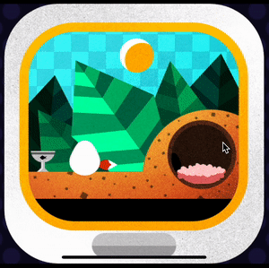

A small game where you need to take care of your virtual fox-pet 🦊

<h1 align="center">Virtual Pet</h1>
 

</img>

Inspired by the excellent (Complete Front-End Project: Build a Game)[https://frontendmasters.com/courses/front-end-game/] course thought by Brian Holt course from FrontendMasters.

## Quick start

1. Clone the repo.
2. Change directory to the project.
3. Run `yarn start` to start the Metro Bundler.
4. Press `i` to start the iOS simulator, `a` to run the Android emulator or `w` for Web.📱
